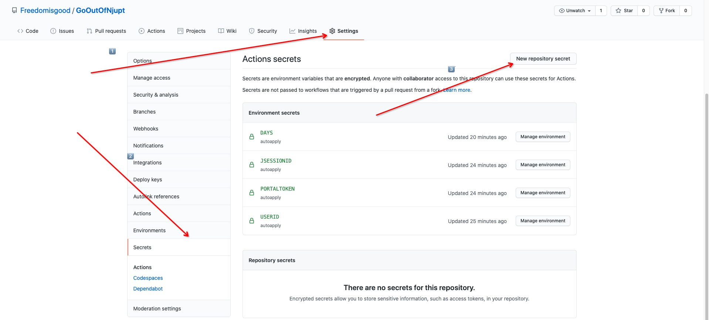

# GoOutOfNjupt

> :bow: I wanna go out of NJUPT day and night! 
>
> 一次性高批量申请离校: NJUPT

采用Github Action执行， 只需将代码Fork到自己仓库，然后设置Secrets值，再开启workflow就行了

需要的Secrets值为:
- UserID
- JSESSIONID
- PortalToken

需要先登陆智慧校园后，再进入网站 http://bsdtlc.njupt.edu.cn/StartWorkflow?Workflow=WF_XSCXSQ 然后打开浏览器的开发者工具, 查看cookies填入

and 需要根据自身情况设置的参数

| 参数                    | 解释               |
| ----------------------- | ------------------ |
| days                    | 设置需要申请的天数 |
| contact_person          | 联系人，如海绵宝宝 |
| contact_person_phonenum | 联系人手机号       |
| your_phonenum           | 你的手机号         |
| apply_reason            | 申请原因           |

---

Secrets大致说明：

具体设置Secrets操作教程见： https://github.com/Freedomisgood/wyycg-autocheckin

